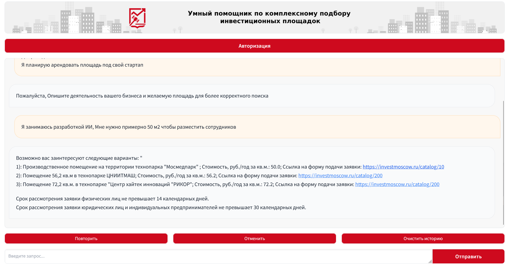

# Проект ИИ Чат-бота для Департамента инвестиционной и промышленной политики города Москвы

Адрес прототипа - http://51.250.17.38:8081/

## Содержание
- [Установка](#установка)
- [Авторы](#авторы)


## Установка
Процесс установки делится на 3 этапа:
1) Клонирования репозитория
2) Указать токен для GigaChat
3) Запустить сервер

Для Клонирования нужно запустить команду в терминале
```
git clone https://github.com/esorshanskaya/chatbot_investmoscow.git
cd chatbot_investmoscow
```

Для Gigachat нужно создать файл ```.env``` и добавить туда строчку ```AUTH_TOKEN = <Ваш Gigachat OAuth токен>```. Так же опционально можно указать ```HOST```, если он отличен от localhost.

Для запуска сервиса нужно выполнить следующую команду.

```
bash ./app.sh
```



## Авторы

Команда 2NoNames